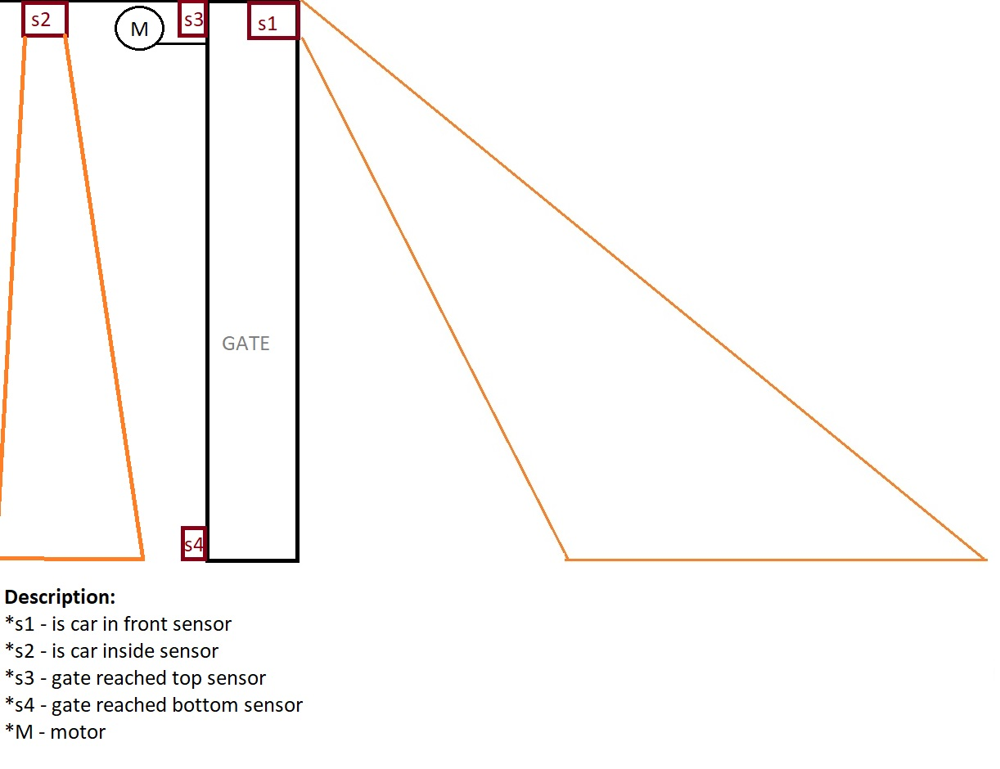

ST Programming Language:

https://en.wikipedia.org/wiki/Structured_text

Code written in:

https://en.wikipedia.org/wiki/Automation_Studio

1. Garage System.

Sequence:

    1) Car gets in front of the gate
    2) Photo electric sensor which is set straight from the gate change its state, gate is getting up until top is reached
    3) Car drives inside
    4) Second photo electric sensor which is mounted inside, gets activated, gate is getting down until bottom is reached
End of the sequence

# Ilustration

